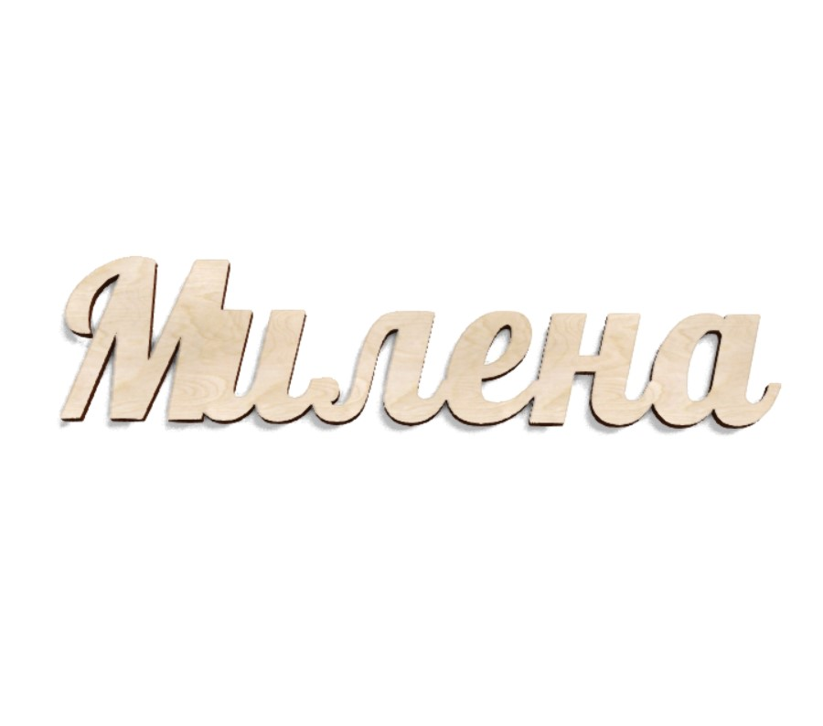

<html>
<head>
<title> Сайт "Значение имени Милена"
</title>
</head>
<body bgcolor="#FFDEAD">
<h1> 
<b> 
Имя Милена  
 

<h2>
<b> 
 Главная  

 
<b>Имя Милена</b> - это славянское имя, означает «милая». Идентичное значение имеют славянские имена Милана, Милада и Милица. Очень часто их употребляют как уменьшительно-ласкательные формы друг для друга, но, тем не менее, эти имена самостоятельные. 
 
Эти имена используются в болгарском, сербском, чешском и польском языках. В эту родственную группу имён, имеющих общий корень «мил» и похожее значение имени (чаще всего - «милая»), также относятся и имена: Мила, Милава, Милева, Милолика, Миломира, Милонега, Миловзора, Милослава, Милуша.  
В СССР имя Милена могло быть истолковано как аббревиатура от имён вождей Маркс и Ленин.
  А в Италии имя Милена используется как краткая форма составных имён, где упоминаются оба эти имени: Мария Елена (Maria Elena, Mariaelena, Marielena), Марилена (Marilena) и Мария Магдалена (Maria Maddalena). Во Франции существует схожее по звучанию имя Mylene (Милен), которое образовано от комбинации имён Marie (Мария) и Helene (Элен, Елена).
  
<right>
